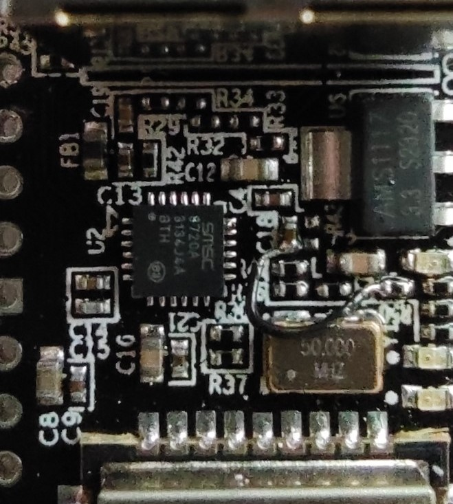

# This is an Arduino Core for ESP32 sketch to build your own firmware for the WT32-ETH01 boards.

## HW modification

The WT32-ETH01, at least until version 1.4, doesn't reset the PHY. This can result in a hanging PHY on occasion, which cannot
be remedied by a reset of the ESP32, but only by a full power cycle. The verified fix proposed here utilized the 50MHz oscillator-enable toggling
performed by the standard IDF implementation to the PHY reset line as well. This makes sure that resetting the ethernet library also
completely initializes the PHY as well.

In order to support full HW reset of the PHY, amend the WT32-ETH01 hardware according to the following steps:

Connect IO16_OSC_EN, hence EN of OSC50MHZ, to nRST of the RTL8720 PHY.

Steps:
- Completely remove R43
- Solder a lead from either pad connected to the trace between C18 and R43 to either pad at the trace between R50 and OSC50MHZ EN

The finished modification should be like this 
